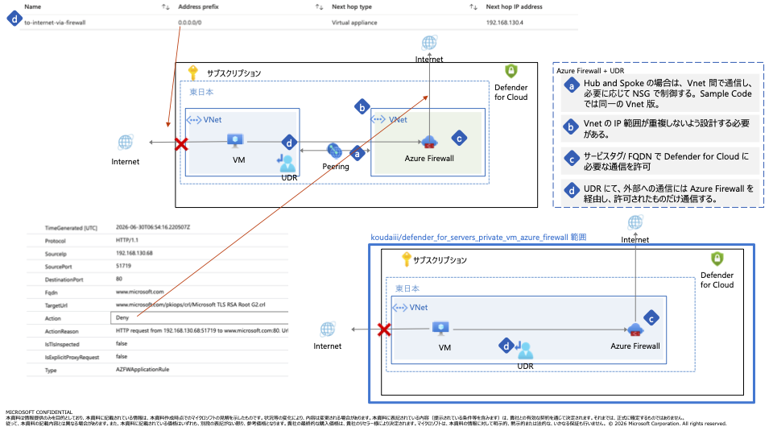
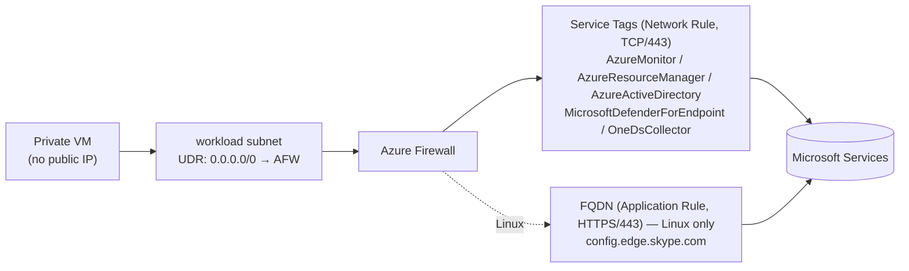

# Defender for Servers on Private VM + Azure Firewall

🌐 **English**: README.md (this page) ・ **日本語**: [README_ja.md](./README_ja.md)



Deploy, with Bicep and shell scripts, a topology where outbound traffic from a **private VM** (no public IP) is funneled through **Azure Firewall**, allowing only the Microsoft-managed services that **Microsoft Defender for Servers Plan 2** requires.

- No direct internet access from the VM
- **Core traffic uses Service Tags (network rules)** — including MDE — so the IP ranges are managed by Microsoft and you don't have to track URL/FQDN changes
- AMA / ARM / Entra ID → `AzureMonitor` / `AzureResourceManager` / `AzureActiveDirectory`
- MDE → `MicrosoftDefenderForEndpoint` + `OneDsCollector` (the latter covers EDR Cyber data, which is **not** included in the former)
- **Linux only**: one FQDN application rule for `config.edge.skype.com` (MDE-for-Linux internal config / ECS — no Service Tag exists). Added automatically when `deployLinuxVm = true`.
- Everything else is denied by Azure Firewall's default behavior

> **Prerequisite for MDE via Service Tags:** enable **"Apply streamlined connectivity settings to devices managed by Intune and Defender for Cloud"** in the Defender portal (security.microsoft.com) advanced settings. Otherwise Defender-for-Cloud-onboarded servers keep using the legacy (standard) destinations, which these service tags don't cover. See [MDE streamlined connectivity URLs](https://learn.microsoft.com/defender-endpoint/streamlined-device-connectivity-urls-commercial).

For the detailed background and design decisions, see [`Defender_for_Servers_PrivateVM_AzureFirewall_Setup.md`](./Defender_for_Servers_PrivateVM_AzureFirewall_Setup.md).

---

## Architecture



| Path | Rule type | Allowed destinations |
|------|-----------|----------------------|
| AMA / ARM / Entra ID | Network rule (Service Tag, TCP/443) | `AzureMonitor` / `AzureResourceManager` / `AzureActiveDirectory` |
| MDE | Network rule (Service Tag, TCP/443) | `MicrosoftDefenderForEndpoint` + `OneDsCollector` |
| MDE (Linux only) | Application rule (FQDN, HTTPS/443) | `config.edge.skype.com` (ECS internal config) |
| Anything else | (Default deny) | — |

---

## Repository layout

```
.
├── README.md                 # English (this page)
├── README_ja.md              # Japanese
├── infra/
│   ├── main.bicep            # Subscription-scoped entry point
│   ├── main.bicepparam       # Default parameter values
│   └── modules/
│       ├── network.bicep     # VNet / Subnet / NSG / Route Table
│       ├── firewall.bicep    # Azure Firewall + Policy + rules
│       ├── route.bicep       # Default route 0.0.0.0/0 → Firewall
│       ├── monitoring.bicep  # Log Analytics workspace (firewall diagnostic logs)
│       ├── vm-linux.bicep    # Sample Ubuntu 24.04 VM (private IP / Trusted Launch / AMA)
│       └── vm-windows.bicep  # Sample Windows Server 2025 Azure Edition VM (same)
└── script/
    ├── setup                 # Deploy
    ├── destroy               # Delete
    ├── ci-test               # Static checks (Bicep compile / bash -n / shellcheck)
    └── verify                # Read-only checks against a deployed env (resources + on-VM MDE + egress-deny)
```

---

## Prerequisites

- [Azure CLI](https://learn.microsoft.com/cli/azure/install-azure-cli) (`az`)
- Signed in with `az login`, with the **Owner** role on the target subscription
  (required to set the Defender plan and assign roles)
- Bash (macOS / Linux / WSL)
- Resource providers registered: `Microsoft.Security`, `Microsoft.Network`, `Microsoft.Compute`

---

## Quick start

```bash
# 1. Sign in
az login

# 2. (Optional) Select the target subscription
export SUBSCRIPTION_ID="<your-subscription-id>"

# 3. Deploy (an SSH key is generated automatically if missing)
./script/setup
```

Common options are passed via environment variables:

```bash
LOCATION=japaneast \
RESOURCE_GROUP=rg-defender-priv-vm \
NAME_PREFIX=dfs-priv \
DEPLOY_LINUX_VM=true \
DEPLOY_WINDOWS_VM=true \
ENABLE_DEFENDER=true \
./script/setup
```

### Deploy Bicep directly

```bash
export SSH_PUBLIC_KEY="$(cat ~/.ssh/dfs_priv_vm.pub)"
export WIN_ADMIN_PASSWORD="<a password that meets complexity rules>"  # for the Windows VM
az deployment sub create \
  --location japaneast \
  --template-file infra/main.bicep \
  --parameters infra/main.bicepparam
```

---

## Parameters

| Parameter | Default | Description |
|-----------|---------|-------------|
| `location` | `japaneast` | Deployment region |
| `namePrefix` | `dfs-priv` | Resource name prefix |
| `resourceGroupName` | `rg-defender-priv-vm` | Resource group to create |
| `adminUsername` | `azureuser` | VM admin username (Linux and Windows) |
| `sshPublicKey` | (required) | SSH public key for the Linux VM (password auth disabled) |
| `adminPassword` | (required for Windows) | Windows VM admin password (auto-generated by `setup` if unset) |
| `vmSize` | `Standard_D2s_v3` | Sample VM size |
| `deployLinuxVm` | `true` | Deploy the Ubuntu 24.04 LTS VM |
| `deployWindowsVm` | `true` | Deploy the Windows Server 2025 Azure Edition VM |
| `vnetAddressPrefix` | `192.168.130.0/25` | VNet address space |
| `firewallSubnetPrefix` | `192.168.130.0/26` | AzureFirewallSubnet (minimum /26) |
| `workloadSubnetPrefix` | `192.168.130.64/26` | Workload subnet |
| `firewallTier` | `Standard` | Azure Firewall SKU |
| `enableDefenderForServersPlan` | `true` | Enable Defender for Servers P2 (set `false` if you configure it in the portal) |
| `enableFirewallDiagnostics` | `true` | Create a Log Analytics workspace and send firewall diagnostic logs to it |

---

## ⚠️ Cost notes

- **Defender for Servers Plan 2 applies to the entire subscription and is billable.**
  If you don't want to change the existing setting, pass `ENABLE_DEFENDER=false` (or `enableDefenderForServersPlan=false`).
- **Azure Firewall (Standard)** incurs hourly and data-processing charges just by running.
- Delete everything with [`script/destroy`](./script/destroy) when you're done.

---

## Verify

1. **Check the deployment**

   ```bash
   az resource list -g rg-defender-priv-vm -o table
   ```

2. **Run the verify script** (read-only; resources + on-VM MDE connectivity + egress-deny test)

   ```bash
   ./script/verify
   ```

   It checks the firewall/route/VMs, then runs `mdatp connectivity test` (Linux) / SENSE Event ID 4 (Windows) via `az vm run-command` (no inbound access needed), and confirms that **`www.microsoft.com` is blocked** (proving default-deny works). MDE onboarding can take tens of minutes, so MDE checks are advisory while the egress-deny check is strict.

3. **Check in Defender for Cloud** (it can take tens of minutes to reflect)
   - `Defender for Cloud -> Inventory -> target VM` (`*-linux` / `*-win`) is **Healthy**
   - The following recommendations are NOT present:
     - *Microsoft Defender for Endpoint agent should be installed*
     - *Azure Monitor Agent should be installed*

   > The sample VMs use **Defender for Servers-supported OSes**: Ubuntu 24.04 LTS / Windows Server 2025 Azure Edition (both with Trusted Launch).

4. **Check the firewall logs** for allow/deny. With `enableFirewallDiagnostics = true` (default), logs go to the `*-law` Log Analytics workspace as structured tables. `./script/verify` queries them at the end; you can also run KQL directly (ingestion lags a few minutes):

   ```kusto
   // Allow/Deny summary (network rules), last hour
   AZFWNetworkRule | where TimeGenerated > ago(1h) | summarize count() by Action

   // Denied traffic (e.g. www.microsoft.com) — proves default-deny
   AZFWNetworkRule | where TimeGenerated > ago(1h) and Action == "Deny"
   | project TimeGenerated, SourceIp, DestinationIp, DestinationPort

   // Application rule hits (Linux config.edge.skype.com)
   AZFWApplicationRule | where TimeGenerated > ago(1h)
   | project TimeGenerated, SourceIp, Fqdn, Action
   ```

---

## Test

```bash
# Static checks (no Azure resources created: Bicep compile + bash -n + shellcheck)
./script/ci-test
```

`script/ci-test` runs automatically on push / pull_request via **GitHub Actions** (`.github/workflows/ci.yml`) — Bicep compile + `bash -n` + shellcheck, no Azure authentication required.

> There is no fully-automated end-to-end test. A true Defender check can't be isolated/automated: the Defender plan and the streamlined-connectivity toggle are subscription/tenant-level, and MDE onboarding takes 30+ minutes. The realistic flow is operational: **`ci-test` → `setup` → wait → `verify` (+ check the Defender portal)**.

---

## Cleanup

```bash
# Delete only the resource group (keep the Defender setting)
./script/destroy

# Also reset Defender for Servers to Free (★ affects the whole subscription)
RESET_DEFENDER=true ./script/destroy
```

---

## Known limitations & notes

- **A fully private setup (zero internet egress) is not achievable for Defender for Servers.**
  Microsoft Security Private Link supports **Defender for Containers only** (the `containers` sub-resource); Servers is out of scope.
  In addition, **MDE does not support Private Link**, so internet egress to the MDE endpoints
  (Service Tags `MicrosoftDefenderForEndpoint` + `OneDsCollector`, or the streamlined FQDN) is mandatory.
  The best achievable level is a hybrid: "AMA made private via AMPLS + MDE allowed through the firewall."
- **This firewall allow-list is scoped to Defender for Servers runtime traffic.**
  Fetching VM extension packages or OS patches may require additional endpoints
  (e.g. `AzureFrontDoor.FirstParty`). Allow them separately as your requirements dictate.
- The VMs have no public IP, so connecting (SSH for Linux / RDP for Windows) requires a separate **Azure Bastion**
  or jump host (no inbound connectivity is needed for Defender itself to work).
- This template assumes Azure-native VMs. For on-premises / multicloud you need Azure Arc, and the
  set of endpoints to allow changes accordingly.
