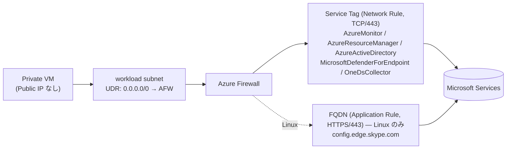

# Defender for Servers on Private VM + Azure Firewall

🌐 **English**: [README.md](./README.md) ・ **日本語**: README_ja.md（このページ）


Public IP を持たない **Private VM** のアウトバウンド通信を **Azure Firewall** に集約し、**Microsoft Defender for Servers Plan 2** が必要とする Microsoft 管理サービスへの通信のみを許可する構成を、Bicep と shell script でデプロイします。

- インターネットへの直接接続を排除
- **コア通信は Service Tag（Network Rule）に統一**（MDE 含む）。IP レンジは Microsoft 管理 → URL/FQDN 追従不要
- AMA / ARM / Entra ID → `AzureMonitor` / `AzureResourceManager` / `AzureActiveDirectory`
- MDE → `MicrosoftDefenderForEndpoint` + `OneDsCollector`（後者は前者に含まれない EDR Cyber data 用）
- **Linux のみ**: `config.edge.skype.com`（MDE for Linux の内部構成/ECS。Service Tag が無い）を FQDN の Application Rule で1本許可。`deployLinuxVm = true` の時に自動追加。
- それ以外は Azure Firewall の既定で拒否

> **MDE を Service Tag で疎通させる前提:** Defender ポータル（security.microsoft.com）の詳細設定で **「Apply streamlined connectivity settings to devices managed by Intune and Defender for Cloud」を ON** にしてください。OFF のままだと Defender for Cloud オンボーディング済みサーバーは旧（standard）宛先を使い、これらの Service Tag ではカバーされません。参考: [MDE streamlined connectivity URLs](https://learn.microsoft.com/defender-endpoint/streamlined-device-connectivity-urls-commercial)

詳細な背景・設計判断は [`Defender_for_Servers_PrivateVM_AzureFirewall_Setup_ja.md`](./Defender_for_Servers_PrivateVM_AzureFirewall_Setup_ja.md) を参照してください。

---

## アーキテクチャ



| 経路 | ルール種別 | 許可先 |
|------|-----------|--------|
| AMA / ARM / Entra ID | Network Rule（Service Tag, TCP/443） | `AzureMonitor` / `AzureResourceManager` / `AzureActiveDirectory` |
| MDE | Network Rule（Service Tag, TCP/443） | `MicrosoftDefenderForEndpoint` + `OneDsCollector` |
| MDE（Linux のみ） | Application Rule（FQDN, HTTPS/443） | `config.edge.skype.com`（ECS 内部構成） |
| 上記以外 | （既定の Deny） | — |

---

## リポジトリ構成

```
.
├── README.md                 # 英語版
├── README_ja.md              # 日本語版（このページ）
├── infra/
│   ├── main.bicep            # サブスクリプションスコープのエントリ
│   ├── main.bicepparam       # パラメータ既定値
│   └── modules/
│       ├── network.bicep     # VNet / Subnet / NSG / Route Table
│       ├── firewall.bicep    # Azure Firewall + Policy + ルール
│       ├── route.bicep       # 0.0.0.0/0 → Firewall のデフォルトルート
│       ├── monitoring.bicep  # Log Analytics ワークスペース（Firewall 診断ログ）
│       ├── vm-linux.bicep    # 検証用 Ubuntu 24.04 VM（Private IP / Trusted Launch / AMA）
│       └── vm-windows.bicep  # 検証用 Windows Server 2025 Azure Edition VM（同上）
└── script/
    ├── setup                 # デプロイ
    ├── destroy               # 削除
    ├── ci-test               # 静的チェック（Bicep compile / bash -n / shellcheck）
    └── verify                # デプロイ済み環境の確認（リソース + VM内MDE疎通 + egress遮断）
```

---

## 前提条件

- [Azure CLI](https://learn.microsoft.com/cli/azure/install-azure-cli)（`az`）
- `az login` 済み、対象サブスクリプションへの **Owner** 権限
  （Defender プラン設定 + ロール割り当てに必要）
- Bash（macOS / Linux / WSL）
- リソースプロバイダー登録: `Microsoft.Security`, `Microsoft.Network`, `Microsoft.Compute`

---

## クイックスタート

```bash
# 1. ログイン
az login

# 2. （任意）対象サブスクリプションを指定
export SUBSCRIPTION_ID="<your-subscription-id>"

# 3. デプロイ（SSH 鍵が無ければ自動生成されます）
./script/setup
```

主なオプションは環境変数で指定します:

```bash
LOCATION=japaneast \
RESOURCE_GROUP=rg-defender-priv-vm \
NAME_PREFIX=dfs-priv \
DEPLOY_LINUX_VM=true \
DEPLOY_WINDOWS_VM=true \
ENABLE_DEFENDER=true \
./script/setup
```

### Bicep を直接デプロイする場合

```bash
export SSH_PUBLIC_KEY="$(cat ~/.ssh/dfs_priv_vm.pub)"
export WIN_ADMIN_PASSWORD="<複雑性要件を満たすパスワード>"  # Windows VM 用
az deployment sub create \
  --location japaneast \
  --template-file infra/main.bicep \
  --parameters infra/main.bicepparam
```

---

## パラメータ

| パラメータ | 既定値 | 説明 |
|-----------|--------|------|
| `location` | `japaneast` | デプロイ先リージョン |
| `namePrefix` | `dfs-priv` | リソース名プレフィックス |
| `resourceGroupName` | `rg-defender-priv-vm` | 作成するリソースグループ |
| `adminUsername` | `azureuser` | VM 管理者名（Linux/Windows 共通） |
| `sshPublicKey` | （必須） | Linux VM の SSH 公開鍵（パスワード認証は無効） |
| `adminPassword` | （Windows 時必須） | Windows VM の管理者パスワード（未指定なら `setup` が自動生成） |
| `vmSize` | `Standard_D2s_v3` | 検証用 VM サイズ |
| `deployLinuxVm` | `true` | Ubuntu 24.04 LTS VM をデプロイ |
| `deployWindowsVm` | `true` | Windows Server 2025 Azure Edition VM をデプロイ |
| `vnetAddressPrefix` | `192.168.130.0/25` | VNet アドレス空間 |
| `firewallSubnetPrefix` | `192.168.130.0/26` | AzureFirewallSubnet（最小 /26） |
| `workloadSubnetPrefix` | `192.168.130.64/26` | ワークロード Subnet |
| `firewallTier` | `Standard` | Azure Firewall SKU |
| `enableDefenderForServersPlan` | `true` | Defender for Servers P2 を有効化（Portal 設定なら `false`） |
| `enableFirewallDiagnostics` | `true` | Log Analytics ワークスペースを作成し Firewall 診断ログを送信 |

---

## ⚠️ コストに関する注意

- **Defender for Servers Plan 2 は「サブスクリプション全体」に適用され、課金対象です。**
  既存の設定を変更したくない場合は `ENABLE_DEFENDER=false`（または `enableDefenderForServersPlan=false`）を指定してください。
- **Azure Firewall（Standard）** は起動しているだけで時間課金 + データ処理課金が発生します。
- 検証が終わったら [`script/destroy`](./script/destroy) で削除してください。

---

## 検証

1. **デプロイ確認**

   ```bash
   az resource list -g rg-defender-priv-vm -o table
   ```

2. **verify スクリプト実行**（読み取り専用：リソース + VM内 MDE 疎通 + egress 遮断テスト）

   ```bash
   ./script/verify
   ```

   Firewall/Route/VM を確認後、`az vm run-command`（受信接続不要）で Linux は `mdatp connectivity test`、Windows は SENSE Event ID 4 を確認し、さらに **`www.microsoft.com` が遮断される**こと（既定 Deny の証明）をテストします。MDE のオンボーディングは数十分かかるため、MDE 確認は参考扱い、egress 遮断テストはハードチェックです。

3. **Defender for Cloud での確認**（反映に数十分かかる場合があります）
   - `Defender for Cloud -> Inventory -> 対象 VM`（`*-linux` / `*-win`）が **Healthy**
   - `Recommendations` に以下が出ていないこと
     - *Microsoft Defender for Endpoint agent should be installed*
     - *Azure Monitor Agent should be installed*

   > 検証用 VM は **Defender for Servers 対応 OS**：Ubuntu 24.04 LTS / Windows Server 2025 Azure Edition（いずれも Trusted Launch）。

4. **Firewall ログ**で許可/拒否を確認。`enableFirewallDiagnostics = true`（既定）で `*-law` ワークスペースに構造化ログが出力されます。`./script/verify` が末尾で照会しますが、直接 KQL も可能です（インジェストに数分のラグ）：

   ```kusto
   // Network Rule の許可/拒否サマリ（直近1時間）
   AZFWNetworkRule | where TimeGenerated > ago(1h) | summarize count() by Action

   // 拒否された通信（例: www.microsoft.com）= 既定 Deny の証明
   AZFWNetworkRule | where TimeGenerated > ago(1h) and Action == "Deny"
   | project TimeGenerated, SourceIp, DestinationIp, DestinationPort

   // Application Rule（Linux: config.edge.skype.com）
   AZFWApplicationRule | where TimeGenerated > ago(1h)
   | project TimeGenerated, SourceIp, Fqdn, Action
   ```

---

## テスト

```bash
# 静的チェック（Azure リソースは作らない: Bicep compile + bash -n + shellcheck）
./script/ci-test
```

`script/ci-test` は **GitHub Actions**（`.github/workflows/ci.yml`）で push / pull_request 時に自動実行されます（Bicep コンパイル + `bash -n` + shellcheck。Azure 認証は不要）。

---

## クリーンアップ

```bash
# リソースグループのみ削除（Defender 設定は維持）
./script/destroy

# Defender for Servers も Free に戻す場合（★サブスクリプション全体に影響）
RESET_DEFENDER=true ./script/destroy
```

---

## 既知の制約・補足

- **完全プライベート（インターネット egress ゼロ）は Defender for Servers では実現不可。**
  Microsoft Security Private Link は **Defender for Containers のみ**対応（`containers` sub-resource のみ）で
  Servers は対象外。加えて **MDE は Private Link 非対応**のため、MDE エンドポイント
  （Service Tag `MicrosoftDefenderForEndpoint` + `OneDsCollector`、または streamlined FQDN）への egress は必須です。
  到達可能な最高水準は「AMA は AMPLS でプライベート化 + MDE は Firewall で許可」のハイブリッドです。
- **本 Firewall 許可リストは Defender for Servers のランタイム通信に絞っています。**
  VM 拡張機能のパッケージ取得や OS パッチ取得には追加のエンドポイント
  （例: `AzureFrontDoor.FirstParty` 等）が必要になる場合があります。要件に応じて別途許可してください。
- VM は Public IP を持たないため、接続（Linux は SSH / Windows は RDP）には別途 **Azure Bastion** や
  踏み台が必要です（Defender の動作確認自体には受信接続は不要）。
- このテンプレートは Azure ネイティブ VM 前提です。オンプレ/マルチクラウドの場合は Azure Arc が必要になり、
  許可するエンドポイントも変わります。
